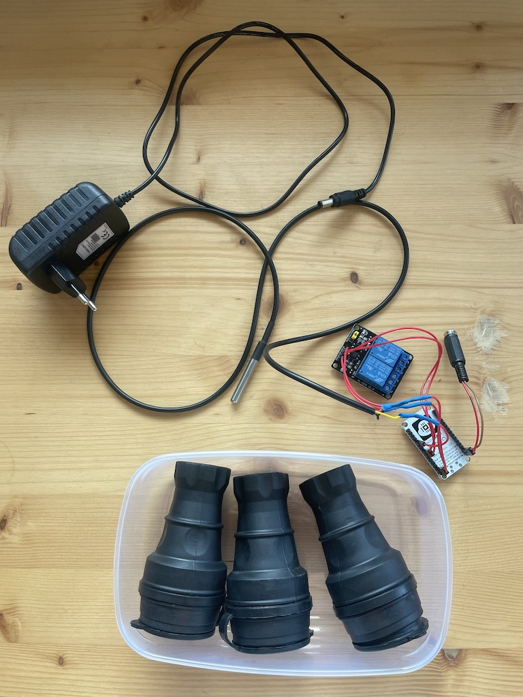
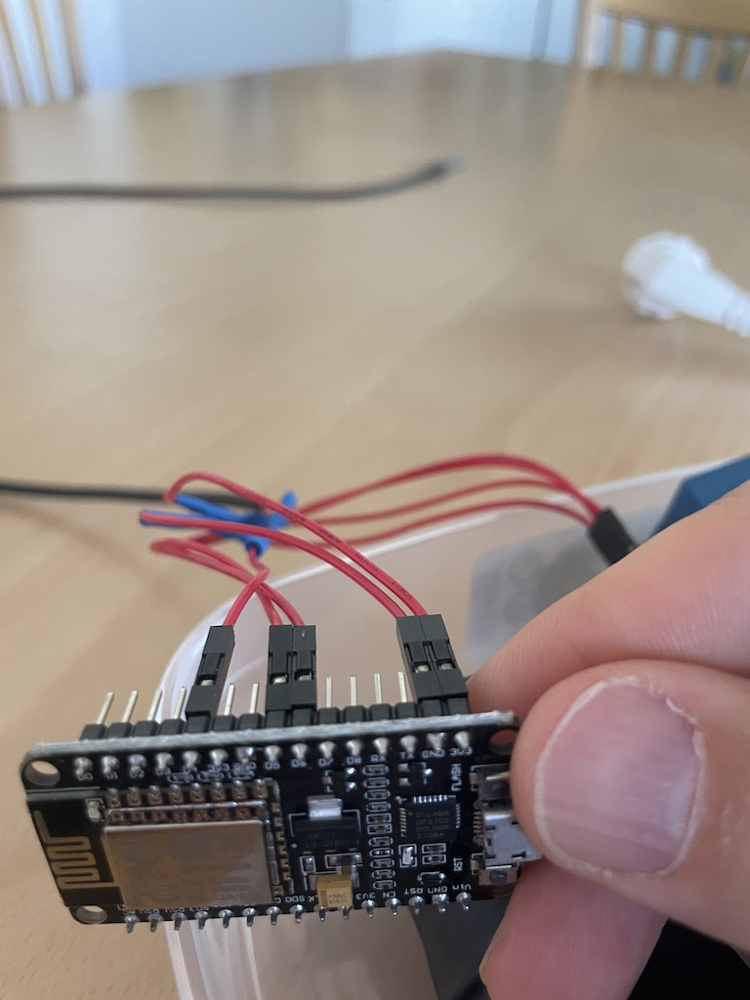
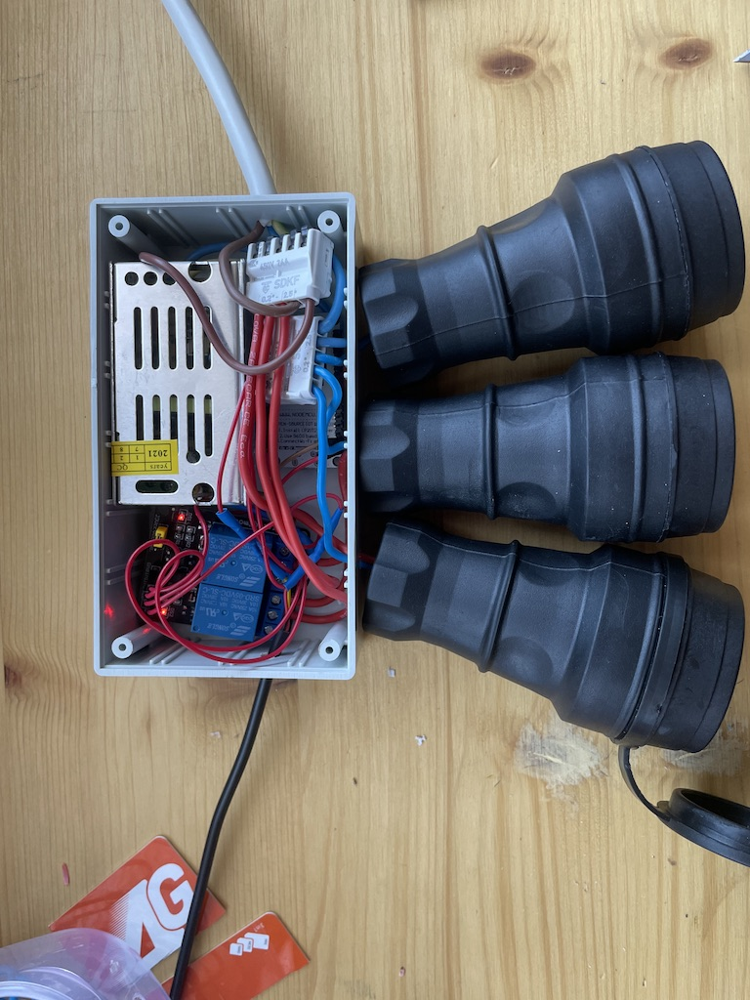
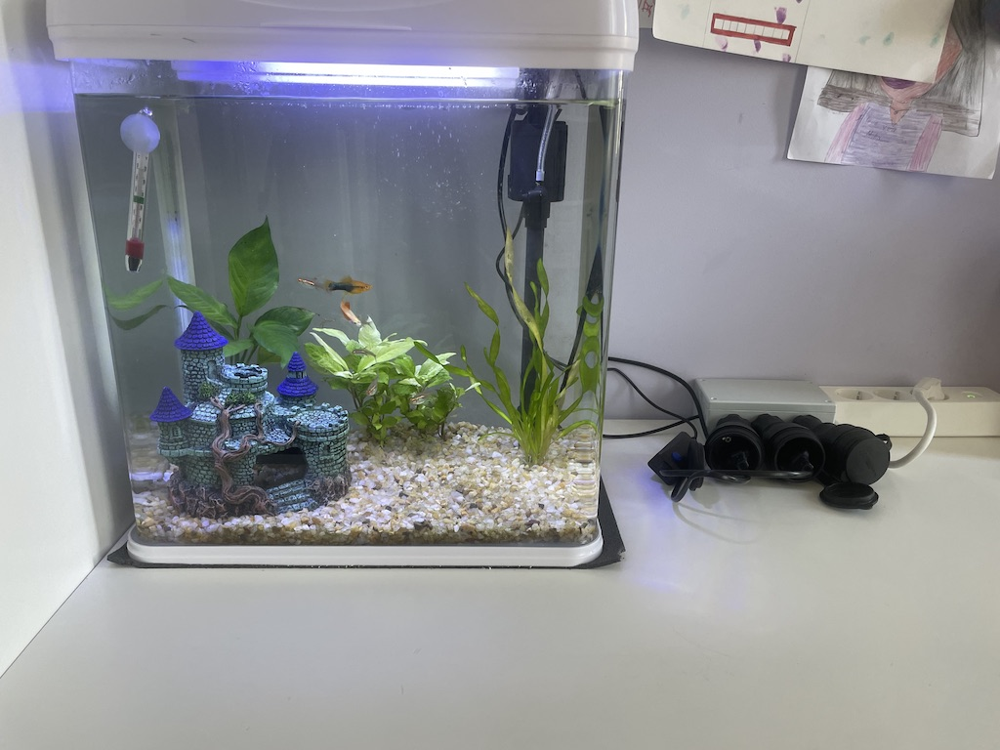

# Aquarium Automator
A device that helps monitor and automate basic aquarium/ fish tank needs


- Monitor
  - [Temperature](temperature_monitor.md)

- Automations
  - relay triggering - for [light](light_automation.md) and temperature.
  - notifications - when the [temperature](notify_temperature.md) is not right
- light schedule
  - fixed schedule - start by creating a [light schedule](light-schedule.md) in Home Assistant then add [automations](light_automation.md) to use it.
- Various reminders for chores, i.e.
  - Feeding
  - Water Cleaning/ Maintenance
  
### Platform ###
- [ESPHome](https://esphome.io) for sensor data and relay trigger. You can check the simple yaml code needed [here](aquarium-automator.yaml)
- [HomeAssistant](https://www.home-assistant.io) for schedule orchestration and notifications


### Requirements ###
- NodeMCU or other ESP based device - generally available. I had a NodeMCU lying in my inbox so that's what I used.
- Relay board (one relay per function you'd like to monitor/conrol). Got mine from local Bulgarian web shop [radev96.com](https://radev96.com)
- A 'dallas' DS18B20 single wire temperature sensor - despite the name it comes with 3 wires - V+,V-, Data
- A number of Dupont or jumper wires available from your local maker's store or online
- A 5V power supply unit that will supply power to the NodeMCU. Alternatively, you can use a power adapter as seen in the first picture.
- One power outlet per relay (in my case I also inluded an extra one that is always on for air supply). A power strip might also do the job if you have one in which outlets can be powered off individually
- Pieces of wire to connect the relays to the power outlets
- A box to put all these items in - the box can be quite tricky. The one shown in my picture is actually the 3rd I've tried and I'm not entirely happy. While it fits the NodeMCU, Relay board and wires, I'll try to find one that would allow me to put the power outlets inside and insulate as much as possible to prevent water/electricity contact.



### Assembly ###

Using dupon wires connect the relays and temperature sensors to the NodeMCU.

Safe pins for relays: GPIO 4, 5, 12, 13, 14 (see ref. 1)

Temperature sensor: GPIO 2/D4 (see ref. 2)


The wiring itself is pretty easy, far simpler than the ASCII diagram below.

```


            ____________________                              _________        
     ADC0  -|                   |-  GPIO16                    |       |
      RES  -|                   |-  GPIO5                     |DS18B20| 
      RES  -|                   |-  GPIO4                     |       |
   GPIO10  -|    NodeMCU        |-  GPIO0             DATA    ---------
    GPIO9  -|                   |-  GPIO2 ____________________|  |GND | VCC     
     MOSI  -|                   |-  3.3V                         |    |
       CS  -|                   |-  GND                          |    |
     MISO  -|                   |-  GPIO14 --------   IN1        |    |
     SCLK  -|                   |-  GPIO12 --------   IN2        |    |
      GND  -|                   |-  GPIO13                       |    |
     3.3V  -|                   |-  GPIO15                       |    |
       EN  -|                   |-  GPIO3                        |    |
      RST  -|                   |-  GPIO1                        |    |
   -- GND  -|                   |-  GND  ____*___________________|____u___
  |   Vin  -|___________________|-  3.3V ____u______*_________________|       
  |       |                         _________|      |                         
  |______ u___________________      |   ____________|                        
          |_________________  |     |  | ________________________        
                           |  |     |  -|   VCC             NO  | 
         ____________  VCC |  |  GPIO12-|   IN2  REL1       COM |--------|
    L   |            | ----|  |  GPIO14-|   IN1             NC  |--L1    |
  ----- |    PSU     | 5V     |    |--- |   GND                 |        |
  | --- |            | GND    |         |   GND             NO  |        |
  | | N |____________| -------          |   VCC  REL2       COM |--------|
  | |                                   |   JD-VCC          NC  |--L2    |
  | |                                   -------------------------        |
  | |___________________________________________________________________ u__* N
  |                                           |       |       |          |
  |                                           *       *       *          |
  |                               OUTPUT  L1  N   L2  N   L3  N          |  220V
  |                                                       |              |
  |_______________________________________________________|______________|___* L 
  ```


Connect the relays to the power outlets and try to fit everything in the box.


Connect the light, air pump and thermostat to the respective power outlets.



### Future Development / ToDo's ###
- Moisture/Water Insulation - kids, fish, fishtanks, water, electricity…
- Actually connect the thermostat to the 2nd relay and come up with an automation that stars it when needed. Right now it is too hot where I leave
- Micro-usb port exposure for potential serial connection without the need for disassembly
- Variable schedule (i.e. gradually increase the light hours from 6 to 8 over a period of 3 months)
- Monitor water quality (ph?)
- Add some buttons that can trigger the relays manually

### References ###
1. [ESP8266 Relay](https://randomnerdtutorials.com/esp8266-relay-module-ac-web-server/)
2. [Nodemcu ESP8266 DS18b20 Waterproof Temperature Sensor Monitoring](https://www.electroniclinic.com/nodemcu-esp8266-ds18b20-waterproof-temperature-sensor-monitoring/)
3. [ESP8266 Pinout Reference](https://randomnerdtutorials.com/esp8266-pinout-reference-gpios/)
4. [WiFi Smart Power Strip with NodeMCU](https://www.instructables.com/WiFi-Smart-Power-Strip-With-NodeMCU/)
