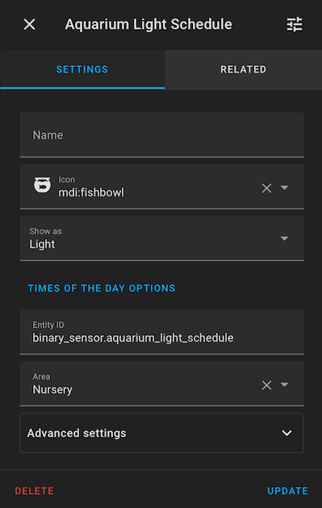
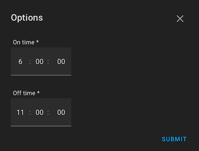

For a static light schedule use the Home Assistant GUI to create a 'Times of Day' Helper.

Go to Settings -> Helpers -> Create Helper and pick Times of the Day

Set desired attributes (i.e. the name and icon)

Finally, set the times when the schedule should be 'on'

ToDo: Switch to a progressively changing schedule, i.e. increase 'on' time to 8h over a 3month period.
