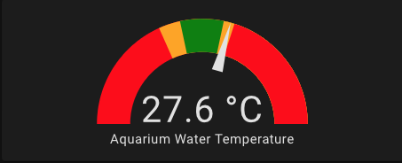

# Temperature Monitoring #

Once you have the DS18B20 connected and defined in ESPHome it will be exposed to HomeAssistant as a senor.
You can then move creating a temperature Gauge Card via the GUI or in yaml using the example below. YAML mode will allow you to define multiple color segments.
My kid's fishes like their water temperature to be between 23 and 28 degrees Celsius, so this is what I've set for *green* segment.


```
type: gauge
entity: sensor.aquarium_water_temperature
min: 10
max: 40
needle: true
segments:
  - from: 10
    color: red
  - from: 21
    color: orange
  - from: 23
    color: green
  - from: 27
    color: orange
  - from: 28
    color: red
```

This creates the following card:


